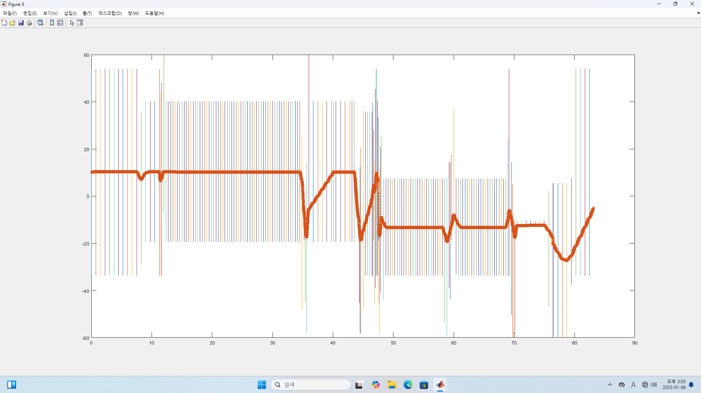
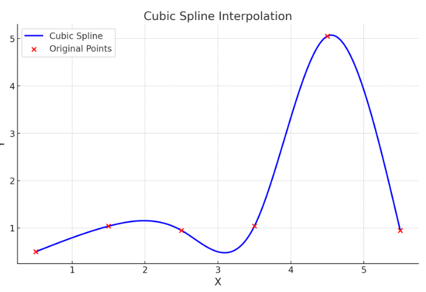
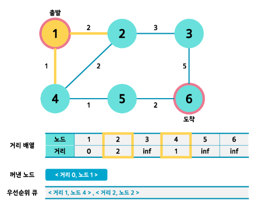

# Linear_Search

**linearsearch_top10th.cpp 파일**

- 현재 y 값을 기준으로 다음 y 범위 내 가능한 모든 y 값을 생성
- 생성된 y 값들과 현재 y 값 사이의 거리를 계산하고, 이 거리를 기준으로 정렬
- 상위 10% 추출: 정렬된 거리에서 상위 10%를 선택

- 중앙값과 가장 가까운 값 선택 = 상위 10%에서 y 범위의 중앙값에 가장 가까운 y 값을 선택
- 다익스트라 경로 계산, 선택된 y 값을 이용해 다익스트라 알고리즘을 통해 최적 경로를 계산
- 시뮬레이션을 위한 MATLAB코드 첨부함 (linearsearch_top10th.m)
> y 범위 내 값들의 끝 값이 되지 않기 위함

---

**dijkspline.cpp 파일**
- linearsearch_top10th.cpp 파일 출력 값 바탕으로 각 y점 좌표들을 부드럽게 잇는 interpolation(cubic spline) 기법을 적용함.
> 출력 결과

<pre>
초기값 y를 입력하세요 (범위: 0.5~1): 0.5
최적 경로:
(0.5, 0.5)
(1.5, 1.04)
(2.5, 0.95)
(3.5, 1.04)
(4.5, 5.05)
(5.5, 0.95)
Cubic Spline Coefficients:
S(x) = 0.5 + 0.607895(x - 0.5) + 0(x - 0.5)^2 + -0.0678947(x - 0.5)^3
S(x) = 1.04 + 0.404211(x - 1.5) + -0.203684(x - 1.5)^2 + -0.290526(x - 1.5)^3
S(x) = 0.95 + -0.874737(x - 2.5) + -1.07526(x - 2.5)^2 + 2.04(x - 2.5)^3
S(x) = 1.04 + 3.09474(x - 3.5) + 5.04474(x - 3.5)^2 + -4.12947(x - 3.5)^3
S(x) = 5.05 + 0.795789(x - 4.5) + -7.34368(x - 4.5)^2 + 2.44789(x - 4.5)^3
</pre>

---

**linearsearch.cpp 파일**
- 각 x값 마다 Y축 Min값, Max값 범위 range탐색하여 점을 잇는 최단거리 지점을 찾아내어 선형으로 구현하는 알고리즘, 다익스트라 알고리즘 활용함
+ 시뮬레이션을 위한 MATLAB코드 첨부함 (linearSearch.m)

---

**사용되는 주요 알고리즘: Dijkstra Algorithm**
- 그래프의 한 정점에서 모든 정점까지의 최단거리를 각각 구하는 알고리즘(최단 경로 문제, Shortest Path Problem)이다.
- 우선순위 큐에 삽입되는 형태는 <거리, 노드> 꼴
- 간선의 수를 E(Edge), 노드의 수를 V(Vertex)라고 했을 때 O(E logV)가 된다.
  우선순위 큐에서 꺼낸 노드는 연결된 노드만 탐색하므로 최악의 경우라도 총 간선 수인 E만큼만 반복한다. 즉 하나의 간선에 대해서는 O(logE)이고, E는 V^2보다 항상 작기 때문에 E개의 간선을 우선순위 큐에 넣었다 빼는 최악의 경우에 대해서는 O(E logV)이다.

